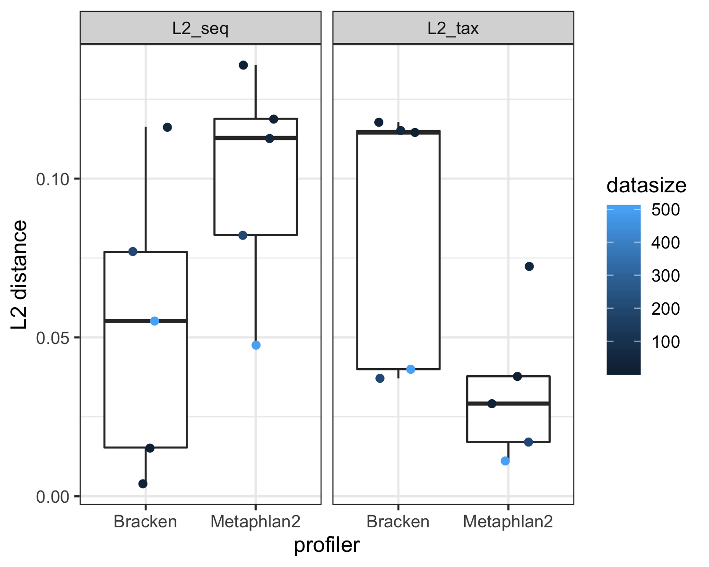

# RETHINKING the benchmarking of taxonomic profilers for shotugun metagenomics data

***
## Introduction
Microbial identification and accurate abundance estimation are still challenging in the metagenomics analysis yet poorly understood and evaluated using appropriate metrics. 

**False positive assignment** High FP rate in the microbial identification is among the most critical yet-to-resolve issues of metagenomics (Ye et al., 2019). This problem leads to severe over-estimation of species richness, confounds true signals in the construction of taxonomic and functional profiles, and impairs the efficancy of compositionality-based community analysis.

**Abundance estimation: sequence abundance VS taxonomic abundance** Microbial abundance in the metagenomics data can be considered either as the relative abundance of reads from each taxa ("sequence abundance") or by inferring abundance of the number of individuals from each taxa by correcting read counts for genome size ("taxonomic abundance"). However, such correction for genome length into abundance estimation is usually missed in most state-of-the-art profilers. Even though it can be manually performed by reweighting the read counts after classification, [previous benchmarking studies](https://www.sciencedirect.com/science/article/pii/S0092867419307755) did not perform appropriate corrections and still used "raw" abundance profiles generated from benchmarked profilers for performance comparisons , resulting in highly misleading or even contradictory conclusions.

## Previous benchmarking results
In the [recent paper](https://www.sciencedirect.com/science/article/pii/S0092867419307755) published on CELL, authors review current state-of-the-art approaches for metagenomic analysis and evaluate the performance of 20 metagenomic classifiers by two key metrics (AUPR score and L2 distance) on simulated and experimental datasets. 
However, both AUPR score using actual abudance and L2 distance using 'raw' profiling results from profilers can provide misleading benchmarking results.

## RE-benchmarking using differential metrics
### Data simulation using a series of genomes (N=10, 20, 50, 200, and 500) with explicit genome length.
We employed [Wgsim](https://github.com/lh3/wgsim) to simulate metagenomics data with a given number of genomes.
Wgsim is orginally a small tool for simulating sequence reads from a reference genome. Here we mixed the genomic sequences from different microbial taxa at the certain percentages in a fasta file and then took as input for Wgsim. 

### AUPR score may bias toward low-precision and high-recall classifiers (such as DNA-to-DNA methods)

The AUPR score can be calculated using either actual abundance or "binary" abundance. In the [CELL paper](https://www.sciencedirect.com/science/article/pii/S0092867419307755), authors used AUPR which essentially calculated as the area under the precision-recall curve by ranging the actual abundance threshold from 0 to 1.0. However, this AUPR score biased toward low-precision and high-recall classifiers (such as Bracken or Kracken with bigger database), which can’t reflect the high-false-positive issue. In the real-world, it is impractical for a user to set an abundance threshold to filter potential false positives (especially for a highly complex microbiome sample). Therefore, we here proposed to calculate AUPR score using the presence of false positives and true positives in the observed profiles. 
### L2 distance calculated using sequence or taxonomic abundance profiles as the expected results

The L2 distance between observed abundance and expected abundance, where can be defined by either sequence or taxonomic abundance in the ground truth.

## Reference
* Ye, S.H., Siddle, K.J., Park, D.J., and Sabeti, P.C. (2019). Benchmarking Metagenomics Tools for Taxonomic Classification. Cell 178, 779-794.
* Segata, N., Waldron, L., Ballarini, A., Narasimhan, V., Jousson, O., and Huttenhower, C. (2012). Metagenomic microbial community profiling using unique clade-specific marker genes. Nat Methods 9, 811-+.
* Truong, D.T., Franzosa, E.A., Tickle, T.L., Scholz, M., Weingart, G., Pasolli, E., Tett, A., Huttenhower, C., and Segata, N. (2015). MetaPhlAn2 for enhanced metagenomic taxonomic profiling. Nat Methods 12, 902-903.
* Wood, D.E., and Salzberg, S.L. (2014). Kraken: ultrafast metagenomic sequence classification using exact alignments. Genome Biology 15.

